##Example 0
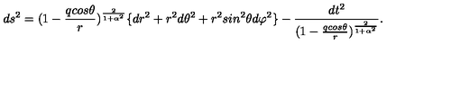

###Model output:

d s ^ { 2 } = ( 1 - \frac { q c o s } { r } ) ^ { \frac { 2 } { 1 + \alpha ^ { 2 } } } \{ d r ^ { 2 } + r ^ { 2 } d \theta ^ { 2 } + r ^ { 2 } s i n ^ { 2 } \theta d \varphi ^ { 2 } \} - \frac { d t ^ { 2 } } { ( 1 - \frac { a c s \theta } { { r + \alpha { 2 } } ) ^ { 1 1 - \alpha g } \right) ^ { 1 - a \alpha \theta } } .

#Example 1
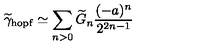

###Model output:

\widetilde { \gamma } _ { \mathrm { h o p } } \simeq \sum _ { n > 0 } \widetilde { G } _ { n } \frac { ( - a ) ^ { n } } { 2 ^ { 2 n - 1 } }

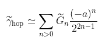

#Example 2
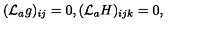

###Model output:

( { \cal L } _ { a } g ) _ { i j } = 0 , ( { \cal L } _ { a } H ) _ { i j k } = 0 ,

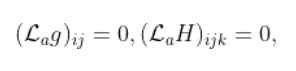

#Example 3
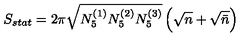

###Model output:

S _ { s t a t } = 2 \pi \sqrt { N _ { 5 } ^ { ( 1 ) } N _ { 5 } ^ { ( 2 ) } N _ { 5 } ^ { ( 3 ) } } \left( \sqrt { n } + \sqrt { n } } \left( \sqrt { n } + \sqrt { n }

#Example 4
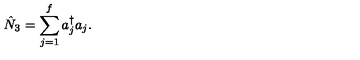

###Model output:
\hat { N } _ { 3 } = \sum _ { j = 1 } ^ { f } a _ { j } ^ { \dagger } a _ { j } .

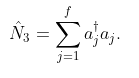

##Example 5
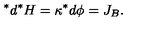

###Model output:
d ^ { * } \! \! \! \! \! \! \! \! \! \! \! \! \! \! \! \! \! \! \! \! \! B } .

##Example 6
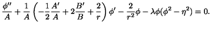

###Model output:
\frac { \phi ^ { \prime \prime } } { A } + \frac { 1 } { A } \left( - \frac { 1 } { 2 } \frac { A ^ { \prime } } { A } + 2 \frac { B ^ { \prime } } { B } + \frac { 2 } { r } \right) \phi ^ { \prime } - \frac { 2 } { r ^ { 2 } } \phi - \lambda \phi ( \phi ^ { 2 } - \eta ^ { 2 } ) = 0 .

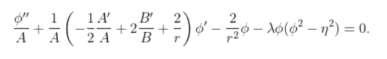

##Example 7
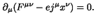

###Model output:
\partial _ { \mu } ( F ^ { \mu \nu } - e j ^ { \mu } x ^ { \nu } ) = 0 .

##Example 8
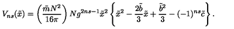

###Model output:
V _ { n s } ( \tilde { x } ) = \left( \frac { \tilde { m } N ^ { 2 } } { 1 6 \pi } \right) N g ^ { 2 n s - 1 } \tilde { x } ^ { 2 } - \frac { 2 \tilde { b } } { 3 } \tilde { x } + \frac { \tilde { b } ^ { 2 } } { 3 } - ( - 1 ) ^ { n ^ { n } s } \tilde { \varepsilon } \right\} .

##Example 9
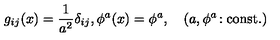

###Model output:
g _ { i j } ( x ) = \frac { 1 } { a ^ { 2 } } \delta _ { i j } , \phi ^ { a } ( x ) = \phi ^ { a } , \quad ( a , \phi ^ { a } : \cosh : \cosh { c } )

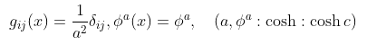

##Example 10
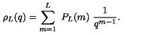

###Model output:
\rho _ { L } ( q ) = \sum _ { m = 1 } ^ { L } \ P _ { L } ( m ) \frac { 1 } { q ^ { m - 1 } } .

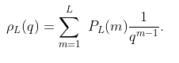

##Example 11
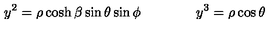

###Model output:
\rho _ { L } ( q ) = \sum _ { m = 1 } ^ { L } \ P _ { L } ( m ) \frac { 1 } { q ^ { m - 1 } } .

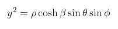

